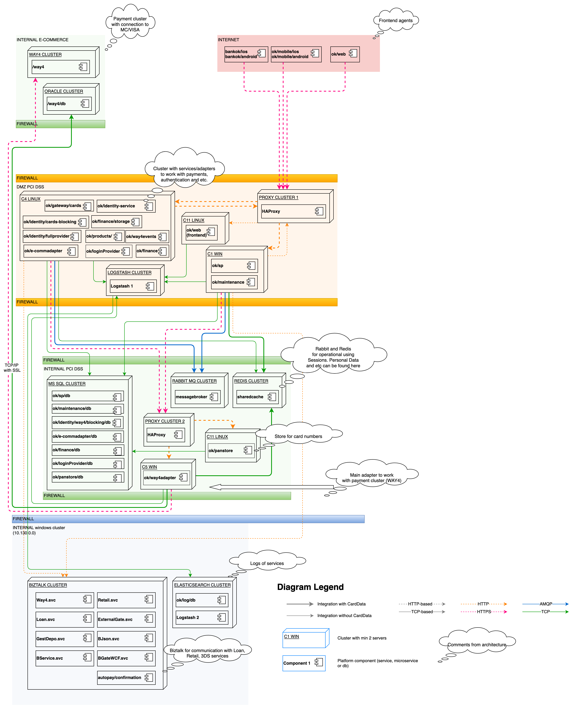
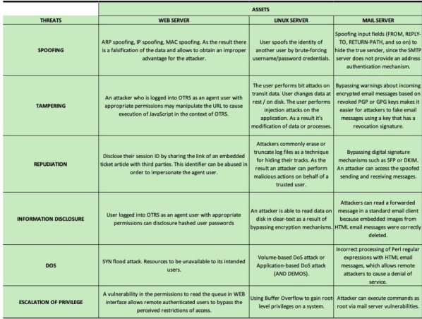
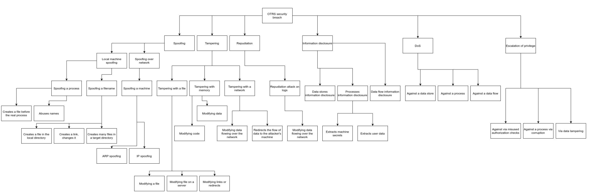

# NCS: Lab 2 - Threats modelling

### Name: Mohamad Nour Shahin, Yehia Sobeh, Ali Hamdan, Matvey Makhnov

### Group number: B22-CBS-01

## Introduction

In this assignment, you will perform threat modeling for the example of designed banking infrastructure that specifically will provide online banking service for the customers. It will include software and different systems as you will see later in the architecture diagram. At this stage Bank is designing the system and ask you for a security consulting. They want to know what potential issues they may have and how to mitigate them.

Threat modeling provides the security specialist with an analysis of the likely profile of attackers, the most likely attack vectors and the assets most desired by the attacker.

Threat modeling helps you to determine the security of your application, identify and investigate potential threats and vulnerabilities and provide results for finding architectural flaws if any.

>

    Join the group by 3-4 people, you may use the same team from the previous assignment. During the work try to make a brainstorm sessions together to find more interesting ideas and solutions.

>

----

## Task 1 - The definition of the object for threat modelling

- Try to look into architecture diagram below and understand the main components, its functionality with reasoning, connections between each other, dependencies etc.

- Write short summary on how do you understand it from the designed functionality perspective

- There are different methodologies for the threat modeling you are free to choose for this assignment and follow that:

    - Microsoft Threat Modelling

    - OWASP Threat Modelling

    - STRIDE

    - PASTA (Stages of Process for Attack Simulation and Threat Analysis)

    - VAST

    - OCTAVE

However, in this assignment description you can see the process that follows the OWASP-based with few simplified changes.

---

### Solution:

Our system contains different components:

1. External Access:

    - The system has both a web application and mobile applications (Android and iOS) that users access over the internet.

    - Users can make requests and interact with the banking system through these applications, which directly connect without an initial firewall layer.

2. Internal E-Commerce Payment Cluster:

   - This area manages secure payments through MasterCard/Visa connections.

    - A firewall layer protects this payment cluster, ensuring safe   transactions with external card networks.
    
    
3. DMZ PCI DSS Zone:

    - A firewall layer protects the DMZ, which contains services for authentication and payment processing.

    - Key components include:

        - Login Provider, Identity Service, and etc: Manage user logins, identity verification, and etc.

        - HA Proxy: A load balancer that distributes traffic to various services.

        - Logstash Cluster: Stores logs from different services for monitoring and security.

       - Maintenance Service: Handles system upkeep and monitoring.

4. Internal PCI DSS Zone:

    - Another firewall layer protects this zone, which houses the database and critical storage.

    - Components include:

        - MS SQL Cluster: Stores data for services in the DMZ zone, like login and identity information.

        - HA Proxy 2: Handles communication between the database and other services, including the payment adapter and card storage (PANStore).
        
        - Redis: Holds personal data securely for fast access.
        
        - RabbitMQ Cluster: Supports high-performance message exchange between services.

5. Internal Windows Cluster:

    - Contains various business services in the BIZTALK cluster, which manages functions like loans, confirmations, retail services, and 3D secure services.
    - Elasticsearch Cluster is included here to store and process logs for better insights and data analysis.

---

## Task 2 -  Decompose the application

At this step you should get an understanding of the application and how it interacts with external entities. This involves gathering information about:

- Entry points - interfaces through which potential attackers can interact with the application.

- Assets - something that the attacker is interested in, it can be some data or a state of the particular computer system (for example it’s availability).

- Trust levels - access rights that the application will grant to external entities.

- Data flows - shows flow of control through system components for particular use cases.

Your task is to:

1. Describe entry points, assets and trust levels in form of tables

2. Select some couple of use cases that you think are the most interesting and prepare Data Flow Diagrams (DFD) for them.

Depending on your modelling, you may have not the complete information about some details of the future application itself, so then you can add some assumptions about it. In this case state them explicitly - in the form of clarification in your report.

>
References:
https://owasp.org/www-community/Threat_Modeling_Process#decompose-the-application
https://www.microsoft.com/en-us/download/details.aspx?id=49168
https://1modm.github.io/threatmodel.html

>

### Solution:

#### Entry Points

| ID  | Name                          | Description                                                                                                       | Trust Levels                                                   |
|-----|-------------------------------|-------------------------------------------------------------------------------------------------------------------|----------------------------------------------------------------|
| 0   | Frontend Agents               | Public-facing applications, including the bank’s website  and mobile apps, accessible over the internet.           | (1) Unauthorized User, (2) Authorized User                     |
| 1   | DMZ Proxy Cluster             | Acts as a secure gateway between external services  and internal resources, using HAProxy for routing.             | (1) Unauthorized User, (5) Limited Internal Services           |
| 2   | Payment Gateway (WAY4 Cluster)| Manages payment processing with external networks  (e.g., NCVISA) for transactions.                                  | (4) Payment Network Partner                                    |
| 3   | MS SQL Cluster                | Database cluster for storing sensitive customer and  transaction data, accessible by internal applications.         | (7) Web Server User Process, (9) Database Administrator        |
| 4   | RabbitMQ Cluster              | Message queueing cluster for internal service  communication, facilitating asynchronous operations.                 | (7) Web Server User Process, (8) Database Read User            |
| 5   | Redis Cluster                 | Caching cluster storing session and frequently accessed  data, improving performance for internal applications.     | (7) Web Server User Process, (8) Database Read User            |
| 6   | Logstash Cluster              | Collects and aggregates logs from various services for  monitoring and auditing purposes.                           | (6) Web Application Administrator                              |
| 7   | Administrative Control Panel  | Restricted interface for support and administrative staff to  manage system configuration and maintenance.          | (3) Support Staff, (6) Web Application Administrator           |
| 8   | Internal Web Cluster          | Backend services handling critical banking operations,  isolated from public access.                               | (7) Web Server User Process                                    |

#### Assets

| ID  | Name                          | Description                                                                                                       | Trust Levels                                                   |
|-----|-------------------------------|-------------------------------------------------------------------------------------------------------------------|----------------------------------------------------------------|
| 1   | Customer Data                 | Personal information, financial details, and transaction  history of customers stored in the database clusters.     | (2) Authorized User, (3) Support Staff,  (9) Database Administrator, (6) Web Server User Process,  (7) Database Read User, (8) Database Read/Write User |
| 1.1 | User Login Credentials        | Credentials used by customers to access online banking  through the website and mobile apps.                        | (2) Authorized User, (3) Support Staff, (6) Web Server User Process,  (9) Database Administrator               |
| 1.2 | Support Staff Login Credentials | Login details for support personnel to access the administrative  interface for account management.               | (3) Support Staff, (9) Database Administrator, (5) Web Application Administrator                               |
| 1.3 | Transaction Records           | Records of all customer transactions, including details like date,  amount, and recipient.                          | (2) Authorized User, (9) Database Administrator, (7) Database Read User,  (8) Database Read/Write User         |
| 2   | System Availability           | Ensures that online banking services, including transactions  and account access, are available 24/7.              | (4) Payment Network Partner, (5) Web Application Administrator                                           |
| 2.1 | Code Execution Capability     | Ability to run backend code on the server, facilitating core  application functions and integrations.               | (5) Web Application Administrator, (6) Web Server User Process                                          |
| 2.2 | SQL Read Access               | Permission to execute read-only SQL queries on the database  to retrieve necessary data for operations.             | (7) Database Read User, (8) Database Read/Write User, (9) Database Administrator                             |
| 2.3 | SQL Read/Write Access         | Permission to perform SQL queries for reading, inserting,  and updating records in the database.                    | (8) Database Read/Write User, (9) Database Administrator                                                 |
| 3   | Web Application Session       | Sessions of authenticated users, allowing continuous access  to account services after login.                      | (2) Authorized User, (3) Support Staff                                                             |
| 3.1 | Access to Database Server     | Full administrative access to manage the database server,  including user data and configurations.                 | (9) Database Administrator                                                                           |
| 3.2 | User Account Management       | Ability to create, edit, or delete user accounts, available to  support staff and administrators.                  | (3) Support Staff, (5) Web Application Administrator                                                 |
| 3.3 | Audit Logs                    | Logs of user and system activities, crucial for monitoring,  auditing, and security compliance.                    | (5) Web Application Administrator, (9) Database Administrator                                        |

#### Trust levels

| ID  | Name                            | Description                                                                                                          |
|-----|---------------------------------|----------------------------------------------------------------------------------------------------------------------|
| 1   | Unauthorized User               | A user accessing the bank's public-facing applications (e.g., website, mobile apps)   without valid login credentials. Access is restricted to non-sensitive information. |
| 2   | Authorized User                 | A customer who has successfully logged in with valid credentials, gaining access  to personal account and transaction services. |
| 3   | Support Staff                   | Bank support personnel with access to manage customer accounts and respond  to support requests.                       |
| 4   | Payment Network Partner         | Trusted external entities (e.g., VISA) involved in payment processing, with access  restricted to transaction handling. |
| 5   | Web Application Administrator   | Responsible for configuring and managing the bank’s web application settings  and access controls.                     |
| 6   | Web Server User Process         | The server-side process/user executing code on the web server and authenticating  with backend services.               |
| 7   | Database Read User              | User account with read-only access to the bank's databases for viewing data  without modifying it.                     |
| 8   | Database Read/Write User        | User account with read and write permissions to modify data in the bank's databases,  typically used by internal services. |
| 9   | Database Administrator          | Full access to manage, configure, and secure the bank’s database, including access  to sensitive financial and user data. |

#### Data flows

I created 4 of Data Flows Diagrams: Login Flow, Identity Flow, Payment Flow, and Loan Flow.

1. Login Flow:

    

2. Identity Flow:

    

3. Payment Flow:

    

4. Loan Flow:

    

Link to tool that we used to draw the flows: [Link](https://drive.google.com/file/d/1NNQ85ZvV8lKaqIK-wJdOimAXsU8cD6ox/view?usp=sharing)

## Task 3 - Determine threats

Now when you have decomposed the system you can determine possible threats.

Categorizations such as STRIDE allow to identify threats in the application in a structured and repeatable manner.

Your task is to apply STRIDE for each asset in the application and come up with a summary table.

- Example of a summary table:

    

Additionally you can design attack tree, based on the posiible attacker goals - exploring the attack paths, the root causes for the threat to be exploited (weaknesses)

- Example of an attack tree:

    

### Solution:

#### STRIDE Threat Model Summary Table for Login Flow:

| Threat               | Login Flow                                                                                                       |
|----------------------|-------------------------------------------------------------------------------------------------------------------|
| Spoofing             | IP spoofing to impersonate users, allowing unauthorized access to restricted pages. Example: Spoofing IP addresses to appear as an internal admin. |
|                      | Forging email headers to appear as a trusted sender. Example: Manipulating "From" field in messages sent by the login system. |
| Tampering            | Injecting malicious scripts in login URLs to alter page behavior. Example: XSS to execute unauthorized actions and steal session cookies. |
|                      | SQL injection to modify or delete login data in the database. Example: Using `' OR '1'='1'` in login fields to bypass authentication. |
| Repudiation          | Deleting session cookies to deny activity, making it hard to track unauthorized logins. Example: Clearing cookies to hide login history. |
|                      | Modifying system or email logs to cover tracks. Example: Deleting login attempts from log files. |
| Information Disclosure | Exposing sensitive login data through directory traversal or lack of encryption. Example: Accessing `/etc/passwd` via URL manipulation. |
|                      | Leaking unencrypted login credentials over HTTP. Example: Intercepting login data sent without HTTPS. |
| Denial of Service    | Overloading the login page with requests to make it unavailable. Example: SYN flood attack to exhaust server resources. |
|                      | Flooding the database or email system with requests to disrupt service. Example: Spamming the server with automated login attempts. |
| Elevation of Privilege | Exploiting permissions to gain admin access. Example: Bypassing login restrictions to access privileged pages. |
|                      | Using buffer overflow to gain root access. Example: Exploiting vulnerabilities in the login backend to escalate privileges. |

#### STRIDE Threat Model Summary Table for Identity Service Flow:

| Threat               | Identity Service Flow                                                                                                       |
|----------------------|-----------------------------------------------------------------------------------------------------------------------------|
| Spoofing             | Impersonating an authorized user to access identity services. Example: Using spoofed credentials to access identity verification. |
|                      | Spoofing service requests to FullProvider or Cards Blocking to manipulate identity responses. Example: Faking request origins to appear as legitimate service calls. |
| Tampering            | Altering identity requests or responses in transit to manipulate user verification. Example: Modifying identity service requests to change user attributes. |
|                      | Injecting malicious data into the Identity Blocking DB to affect the identity status. Example: SQL injection in identity verification records to mark legitimate users as blocked. |
| Repudiation          | Authorized users denying identity verification attempts due to weak tracking. Example: Users claiming they did not initiate certain verification requests. |
|                      | Lack of logging may allow services to deny actions taken in FullProvider or Cards Blocking. Example: Deleting logs to hide identity-related activities. |
| Information Disclosure | Exposing sensitive user identity information if encryption is not enforced. Example: Intercepting identity data due to unencrypted communication between services. |
|                      | Unauthorized access to identity verification logs in Logstash 1. Example: Viewing identity service logs that contain sensitive user data. |
| Denial of Service    | Overloading the identity service with frequent verification requests, impacting its availability. Example: Sending excessive requests to exhaust service capacity. |
|                      | Flooding the Identity Blocking DB with requests to slow down response times. Example: Overwhelming the database with requests to impact service performance. |
| Elevation of Privilege | Exploiting identity service permissions to gain unauthorized access to restricted resources. Example: Bypassing authorization checks to reach administrative features in identity service. |
|                      | Manipulating Cards Blocking responses to elevate privileges within the identity verification process. Example: Altering response data to gain higher privileges within the system. |

### STRIDE Threat Model Summary Table for Payment Flow:

| Threat               | Payment Flow                                                                                                       |
|----------------------|---------------------------------------------------------------------------------------------------------------------|
| Spoofing             | Impersonating an authorized user to initiate fraudulent payment requests. Example: Using stolen credentials to perform unauthorized transactions. |
|                      | Spoofing requests to HA Proxy or Way4Adapter to manipulate payment requests. Example: Faking request headers to appear as legitimate payment transactions. |
| Tampering            | Modifying payment details in transit, such as amount or recipient, to divert funds. Example: Changing payment amounts in requests passing through HA Proxy. |
|                      | Injecting malicious data into Way4 DB to affect payment history. Example: SQL injection to alter transaction records in the payment database. |
| Repudiation          | Users denying payment transactions due to insufficient logging. Example: Claiming they didn’t initiate specific payments or transfers. |
|                      | Lack of logging in payment processing may allow services to deny actions. Example: Deleting payment logs in Way4Events to hide fraudulent transactions. |
| Information Disclosure | Exposing sensitive payment information, such as card details, if encryption is not enforced. Example: Intercepting card data due to unencrypted communication between services. |
|                      | Unauthorized access to payment logs in Logstash 1. Example: Viewing payment transaction logs that contain sensitive user data. |
| Denial of Service    | Overloading the payment system with excessive payment requests, affecting its availability. Example: Flooding the system with payment requests to slow down processing. |
|                      | Flooding Way4 DB with requests to delay or disrupt payment processing. Example: Sending repeated queries to overload the database server. |
| Elevation of Privilege | Exploiting payment service permissions to gain unauthorized access to privileged operations. Example: Bypassing restrictions to modify payment configurations in Way4Adapter. |
|                      | Manipulating Redis Shared Cluster responses to escalate privileges within the payment flow. Example: Altering cached data to gain access to restricted payment resources. |

#### STRIDE Threat Model Summary Table for Loan Flow:

| Threat               | Loan Flow                                                                                                       |
|----------------------|---------------------------------------------------------------------------------------------------------------------|
| Spoofing             | Impersonating an authorized user to submit loan applications. Example: Using stolen credentials to request loans fraudulently. |
|                      | Spoofing requests to HA Proxy or Finance to manipulate loan processing. Example: Faking request headers to appear as legitimate loan requests. |
| Tampering            | Altering loan application details, such as loan amount or terms, in transit. Example: Modifying loan parameters in requests passing through HA Proxy. |
|                      | Injecting malicious data into Finance DB to alter loan records. Example: SQL injection to modify loan approval status in the database. |
| Repudiation          | Users denying loan applications or repayments due to weak logging. Example: Claiming they didn’t request specific loans or payments. |
|                      | Lack of logging may allow services to deny actions taken in Finance Storage or Loan Service. Example: Deleting loan request logs in Logstash to hide fraudulent activities. |
| Information Disclosure | Exposing sensitive loan details, such as applicant data, if encryption is not enforced. Example: Intercepting personal financial data due to unencrypted communication between services. |
|                      | Unauthorized access to loan processing logs in Logstash 1. Example: Viewing loan transaction logs that contain sensitive user information. |
| Denial of Service    | Overloading the loan service with excessive loan requests, impacting availability. Example: Flooding the system with loan applications to slow down processing. |
|                      | Flooding Finance DB with queries to disrupt loan processing times. Example: Repeatedly querying the database to degrade performance. |
| Elevation of Privilege | Exploiting loan service permissions to access privileged operations in Finance Storage. Example: Bypassing restrictions to modify loan processing rules. |
|                      | Manipulating Finance Storage responses to escalate privileges within the loan flow. Example: Altering cached data to gain access to restricted loan-related resources. |

#### STRIDE Threat Model Summary Table for Transaction Records Flow

| Threat               | Transaction Records Flow                                                                                                       |
|----------------------|-----------------------------------------------------------------------------------------------------------------------------|
| Spoofing             | Impersonating a legitimate user to access transaction records. Example: Using stolen credentials to view transaction data. |
|                      | Spoofing requests to database clusters or proxies to gain unauthorized access to sensitive transaction data. Example: Faking request headers to appear as a privileged service. |
| Tampering            | Modifying transaction records in transit to change transaction details (e.g., amounts, timestamps). Example: Altering data during transmission to manipulate transaction records. |
|                      | Injecting malicious data into transaction databases to falsify records. Example: SQL injection to add or modify transaction entries in the database. |
| Repudiation          | Denying actions such as viewing or modifying transaction records due to insufficient logging. Example: Users claiming they did not access or alter certain records. |
|                      | Lack of logging within database clusters may allow services to deny actions. Example: Deleting transaction logs to erase evidence of unauthorized data access. |
| Information Disclosure | Exposing sensitive transaction information, such as account numbers and amounts, if encryption is not enforced. Example: Intercepting transaction data due to unencrypted database communication. |
|                      | Unauthorized access to transaction logs in Logstash. Example: Viewing detailed transaction records that contain sensitive financial information. |
| Denial of Service    | Overloading the transaction processing system with numerous requests, affecting availability. Example: Flooding the transaction service to slow down response times. |
|                      | Flooding the transaction database with queries to disrupt normal operations. Example: Running excessive database queries to degrade performance. |
| Elevation of Privilege | Exploiting transaction record permissions to gain unauthorized access to sensitive financial records. Example: Bypassing access restrictions to modify high-privilege transaction data. |
|                      | Manipulating Redis or other caching clusters to escalate privileges and access restricted transaction records. Example: Altering cache data to bypass security checks. |

## Task 4 - The potential attacks severity calculation (CVSS score)

Assess the severity of the attack on the targeted assets using the common vulnerability scoring system, CVSS, to consider the impact of the threats you have just identified.

>
CVSS calucaltor https://www.first.org/cvss/calculator/3.0

>

### Solution:

**CVSS Table for Login Flow**
| Threat                 | CVSS score | Severity category |
|:---------------------- |:----------:| ----------------- |
| Spoofing               |    6,5     | Medium            |
| Tampering              |    8,5     | High              |
| Elevation of Privilege |    7,4     | High              |
| Repudiation            |     6,0    |  Medium           |
| Denial of Service      |    5,9     |  Medium           |
| Information Disclosure |    5,8     |Medium             |

**CVSS Table for for Identity Service Flow**
| Threat      | CVSS score | Severity category |
|:----------- |:----------:| ----------------- |
| Spoofing    |    6,5     | Medium            |
| Tampering   |    8,5     | High              |
| Repudiation |    4,0     | Medium            |
|Information Disclosure|6,4|Medium             |
|Denial of Service|    5,9 |  Medium           |
|Elevation of Privilege|7,4|  High             |

**CVSS Table for Payment Flow**
| Threat                 | CVSS score | Severity category |
|:---------------------- |:----------:| ----------------- |
| Tampering              |    7,1     | High              |
| Information Disclosure |    6,5     | Medium            |
| Denial of Service      |    5,3     | Medium            |
| Spoofing               |    7,4     | High              |
| Repudiation            |    5,5     |  Medium           |
| Elevation of Privilege |    7,4     |    High           |

**CVSS Table for Loan Flow**
| Threat                 | CVSS score | Severity category |
|:---------------------- |:----------:| ----------------- |
| Tampering              |    8,5     | High              |
| Information Disclosure |    6,5     | Medium            |
|  Spoofing              |    7,7     |  High             |
|   Repudiation          |    5,4     |  Medium           |
|   Denial of Service    |    5,8     |   Medium          |
| Elevation of Privilege |    6,9     |   Medium          |

**CVSS Table for Transaction Records Flow**
| Threat                 | CVSS score | Severity category |
|:---------------------- |:----------:| ----------------- |
| Repudiation            |    6,5     | Medium            |
| Information Disclosure |    6,5     | Medium            |
| Denial of Service      |    5,3     | Medium            |
|   Spoofing             |    7,4     |  High             |
|  Tampering             |    8,5     |   High            |
|  Elevation of Privilege|    7,4     |    High           |

**CVSS Score Range:**
*  Low (0.1 - 3.9): Minimal impact; unlikely to be prioritized.
*  Medium (4.0 - 6.9): Noticeable impact; requires some attention.
*  High (7.0 - 8.9): Severe impact; should be prioritized.
*  Critical (9.0 - 10.0): Extreme impact; must be addressed immediately.

**Conclusion:**

*  **Login Flow** 
   The highest threat scores are from Tampering - 8,5 and Elevation of Privilege - 7,4 indicating that these issues could cause significant security risks.
*  **Identity Service Flow**
   Similar to the Login Flow, Tampering scores high - 8,5 signaling a major risk of unauthorized modification of identity-related data. Repudiation has a lower score - 4,0  suggesting it is a lower-priority risk. 
*  **Payment Flow**
   Denial of Service - 5,3 presents a moderate risk but could disrupt the availability of the payment service.
*  **Loan Flow**
    Tampering - 8,5 is a critical risk in this flow. Information Disclosure - 6,5 also poses a risk to confidentiality.
*  **Transaction Records Flow**
   Repudiation - 6,5 and Information Disclosure 6,5 represent substantial risks, particularly if transaction records can be altered or exposed.
---

## Task 5 - Threat modeling summarization and countermeasures determinition

Consolidate all information into a final summary table as below:

| Asset                  | Category   | Threat | Vulnerability | Score | Countermeasure |
|:---------------------- |:----------:| ------ | ------------- | ----- | -------------- |

- Asset - for example “User credentials”.

- Category - according to STRIDE, for example “Information disclosure”.
Note that you can skip category, if you think there is no threat for that data flow that falls in that category

- Threat - a threat itself that falls into category, for example “User credentials are exposed and obtained by an attacker”.

- Vulnerability - a particular flaw in the system that may be exploited and lead to the threat realization, for example “During the authentication process password is passed as plain text” or ”Password is stored as plain text in the database”.

Based on your CVSS score, decide which risk you are going to accept, eliminate or mitigate and fill the last countermeasure column accordingly:

- Accept: decide that the business impact is acceptable

- Eliminate: remove components that make the vulnerability possible

- Mitigate: add checks or controls that reduce the risk impact, or the chances of its occurrence

>
References:
https://owasp.org/www-community/Threat_Modeling_Process#determine-and-rank-threats
https://owasp.org/www-community/Threat_Modeling_Process#determine-countermeasures-and-mitigation
https://github.com/OWASP/threat-model-cookbook
https://www.enisa.europa.eu/topics/threat-risk-management/threats-and-trends/enisa-thematic-landscapes/threat-landscape-of-the-internet-infrastructure/threat-mind-map/view
https://attack.mitre.org/matrices/enterprise/
https://github.blog/2020-09-02-how-we-threat-model/
>

### Solution:

| Asset                               | Category               | Threat                                        | Vulnerability                                                  | Score | Countermeasure                                                       |
|:----------------------------------- | ---------------------- | --------------------------------------------- | -------------------------------------------------------------- |:-----:| -------------------------------------------------------------------- |
| **1. Customer Data**                    | Information Disclosure | Unauthorized data exposure                    | Lack of encryption for sensitive data                          |  6,5  | Encrypt sensitive data                                     |
| 1.1 User Login Credentials          | Spoofing               | Impersonation of users                        | Weak password policy allows guessing of user credentials       |  6,5  |Implement MFA (multi-factor authentication) and strong password policies                 |
| 1.2 Support Staff Login Credentials | Elevation of Privilege | Unauthorized privilege escalation             | Insufficient access controls for support staff                 |  7,4  |Enforce role-based access controls                         |
| 1.3 Transaction Records             | Information Disclosure | Data exposure| Lack of data masking for sensitive transaction records         |  6,5  |Apply data masking and encryption                          |
| **2. System Availability**              | Denial of Service      | Denial of Service                             | No rate limiting or DDoS protection                            |  5,3  |Implement rate limiting, firewalls, and DDoS protection    |
| 2.1 Code Execution Capability       | Tampering              | Unauthorized modification of system processes | Lack of integrity checks in code execution                     |  8,1  |Use integrity checks and access control for code execution |
| 2.2 SQL Read/Write Access           | Elevation of Privilege | Escalation of privileges via SQL              | Insufficient access restrictions for read/write SQL operations |  7,4  |Restrict write access, enforce role-based access           |
| 2.3 SQL Read Access                 | Information Disclosure | Unauthorized data read access                 | No access control and monitoring for SQL read access      |  6,5  |Monitor access and restrict SQL read permissions           |
| **3. Web Application Session**          | Repudiation            | Lack of responsibility for their actions            | Insufficient logging of user actions                           |  5,2  | Accept because of low impact                                         |
| 3.1 Access to Database Server       | Tampering              | Unauthorized modification of database         | Weak access controls on database server                        |  8,1  |Enforce strict access controls and use database firewalls  |
| 3.2 User Account Management         | Spoofing               | Impersonation of account holders              | Lack of strong authentication methods                          |  6,5  | Use MFA and regular account audits                                   |
| 3.3 Audit Logs                      | Repudiation            | Insufficient logging of activities            | Lack of comprehensive audit logging                            |  5,2  | Accept or improve logging and retention policies                     |

This table allows us to summarize the threats, risk and implement appropriate countermeasures for each threat. This approach will help ensure that you have addressed each threat based on it's strictness and impact.