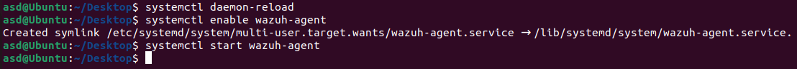
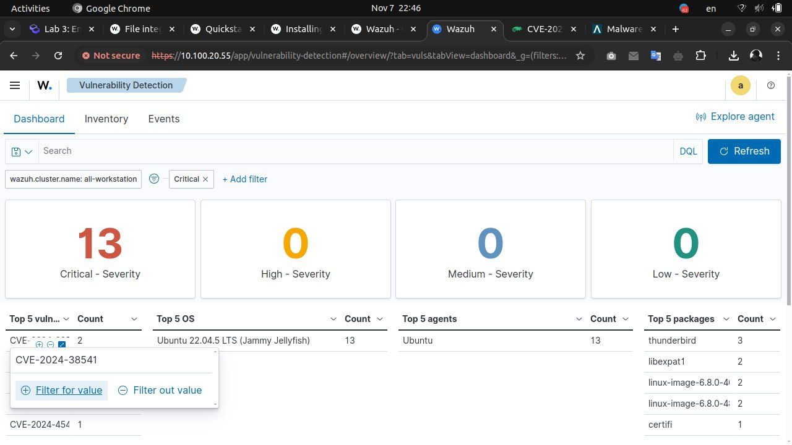
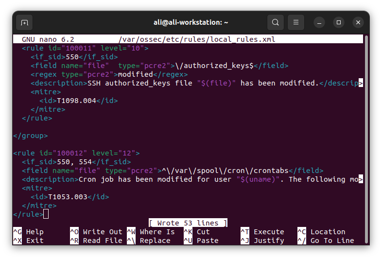

# Lab 3: Endpoint security (EDR/SIEM)


### Name: Mohamad Nour Shahin, Yehia Sobeh, Ali Hamdan, Matvey Makhnov

### Group number: B22-CBS-01


>

You may work in teams of 3 - 4 students to complete the assignment.


>

Endpoint detection and response (EDR) is a cybersecurity technology that monitors endpoints, such as servers, laptops, and Internet-of-Things devices, to mitigate malicious cyber threats.


SIEM stands for Security Information and Event Management. It’s a field of computer security that combines Security Information Management (SIM) and Security Event Management (SEM). SIEM tools provide real-time analysis of security alerts generated by endpoints, applications and network hardware.


Wazuh is an open-source security platform that provides unified EDR and SIEM protection for endpoints and cloud workloads. SIEM and EDR platforms are commonly used in cybersecurity to enhance the security posture of organizations.


## Tasks
---

### Requirements


Setup the following requirements to complete the tasks in this lab:

- Deploy the Wazuh central components on a Linux endpoint using the [Quickstart installation](https://documentation.wazuh.com/current/quickstart.html#installing-wazuh) guide.

>

You can also deploy Wazuh with [OVA virtual machine](https://documentation.wazuh.com/current/deployment-options/virtual-machine/virtual-machine.html).

>

- [Deploy the Wazuh agent](https://documentation.wazuh.com/current/installation-guide/wazuh-agent/wazuh-agent-package-linux.html#deploying-wazuh-agents-on-linux-endpoints) on a second Linux endpoint. This will be the monitored endpoint you aim to protect.


### Solution:

- I installed the server on ubuntu device:


- I used Ubuntu 22.04 as client agent, here is after install it in Virtualbox


- I added the Wazuh repo and install it.


- Deploy wazuh agent with specifying the ip address of the server:

```
10.100.20.55
```


- Enable and start Wazuh agent service




- finally, you can see the dashboard with my agent inforamtion:


### 1. File integrity monitoring


- Explain the importance of file integrity monitoring.


- Configure the agent on your monitored endpoint to perform file integrity monitoring. Monitor any directory or file of your choice and show alerts on the Wazuh dashboard when changes are made to the monitored directory or file.

>
Follow the [FIM PoC](https://documentation.wazuh.com/current/proof-of-concept-guide/poc-file-integrity-monitoring.html) described in the Wazuh official documentation.


>


---

### Solution:

- File integrity monitoring (FIM) is crucial for spotting weak points in systems that hackers could exploit. It helps organizations address issues early, strengthens defenses, and aids in regulatory compliance, reducing risks of fines and operational disruptions. FIM also guides security teams to focus on critical risks, making overall protection more effective.


I added this configruation to the file osscf.config

```command
<directories check_all="yes" report_changes="yes" realtime="yes">/home</directories>
```

and updated the interval to run the testing each 5m

```command
<interval>5m</interval>
```

then restart the service:

```
sudo systemctl restart wazuh-agent
```


create new file:


delete file:


from the dashboard:

Deleted file:


added file:


---


## 2. Vulnerability detection


- Describe the significance of vulnerability detection.

- What are the differences between authenticated and unauthenticated vulnerability scans?


- Why do we need to perform periodic vulnerability scans?


- On the Wazuh dashboard, show the vulnerabilities discovered on the monitored endpoint.

    >

    Install at least two vulnerable apps if none is discovered on your default installation.

    >


- Patch at least two vulnerabilities on the endpoint and show updates on the Wazuh dashboard to prove that the patch worked.


    >

    You may need to wait an hour for the next system inventory update to show results of the patch.

    >


- Which type of scan is Wazuh vulnerability detection scan more closely related with (authenticated or unauthenticated)?

Give reasons for your answer.


### Solution:


1.  Vulnerability detection finds weaknesses that attackers could exploit. By addressing these early, companies can prevent issues, strengthen security, stay compliant, and avoid unexpected downtime. It also allows security teams to prioritize the most critical threats, ensuring more focused protection.

---

2. **Authenticated Scans**: Use login credentials to access deeper internal details, improving accuracy and reducing false positives. They reveal vulnerabilities that attackers could exploit from an internal perspective.


    **Unauthenticated Scans**: Run without credentials, showing only what an external attacker would see (e.g., open ports). They are useful for finding publicly exposed weaknesses.

    In short, authenticated scans provide an internal view, while unauthenticated scans offer an external attacker’s perspective. Both are essential for a comprehensive security assessment.

---

3.  **Spot New Threats**: Periodic scans catch emerging vulnerabilities.

     **Adapt to System Changes**: Scans reveal issues from updates or configuration changes.

    **Meet Compliance Standards**: Regular scans ensure compliance with security regulations.

     **Prevent Breaches**: Scans detect vulnerabilities before they can be exploited.

    **Stay Proactive**: Regular scanning helps close security gaps and strengthen defenses.

    Regular scans are key to staying secure, compliant, and ahead of threats.

---

4. When checking the Dashboard I fonund:




---

5. I updated two of the packges ```libarchieve3``` and ```libexpat1```

    


    

    
    


    


    after updating we notice the removing of critical issues

    

---

6. Wazuh vulnerability detection scans are more like **authenticated scans** because:
    
    1. **Direct System Access**: Wazuh agents are installed on monitored systems, accessing internal details.

    2. **Detailed Scanning**: This internal access enables deeper scanning.

    3. **Better Accuracy**: With direct access, Wazuh reduces false positives.

---


## 3. Detecting cryptominers

>


Refer to [Detecting illegitimate crypto miners on Linux endpoints](https://wazuh.com/blog/detecting-illegitimate-crypto-miners-on-linux-endpoints/) for guidance.


>

- What are cryptominers?

- Are cryptominers inherently malicious? Justify your answer.

- What are the generic steps through which Linux cryptomining botnets operate?

- Configure your Wazuh server to detect at least two of the steps highlighted above.

- Trigger alerts for the rules you have created by simulating the cryptominer behavior you are detecting.


- Provide explanation for any regular expression used in your rule.


>


Official documentation of [Wazuh rule syntax](https://documentation.wazuh.com/current/user-manual/ruleset/ruleset-xml-syntax/rules.html).


You can also analyze the full event log by expanding the alert on the Wazuh dashboard. This will help understand the rule better.

>


### Solution:


1.  Cryptominers are programs that use computing power to mine cryptocurrency by solving blockchain problems. While some mining is legal, **cryptojacking** is the illegal practice of installing mining software without permission, leading to slow systems and increased energy costs.

    Detecting cryptominers on Linux involves monitoring for unusual activity, like high CPU usage or unknown processes, which may indicate unauthorized mining.


---


2. Cryptominers aren’t inherently malicious; they’re tools for mining cryptocurrency. However, they become malicious if installed without permission, a practice known as cryptojacking, which leads to slow performance, high energy costs, and possible hardware damage.


---


3.   Linux cryptomining botnets usually operate through these steps:

     - **Infection**: Attackers gain access through system vulnerabilities or phishing.

     - **Deploying the Miner**: Cryptomining software is installed.

     - **Establishing Persistence**: Cron jobs or startup scripts ensure the miner runs after reboots.
     
     - **Using System Resources**: The miner uses CPU and GPU power, often hidden in the background.

     - **Spreading**: The botnet tries to infect other devices on the network.

     - **Connecting for Updates**: The botnet communicates with a server for updates or to adjust mining settings.


---


4. open the config file:


we configure the changing of authorized_keys, cpu usage, and ssh connection failures.


CPU Usage:


authorized_keys file:



on the agent:


ssh connections:


---


5. 

results on dashboard after alerts:


---


6. `\/authorized_keys$`
    
    - This pattern matches any file path ending in `authorized_keys`.
    - *Explanation*:
      - **`\/`**: Matches the `/` character in the file path.
      - **`authorized_keys`**: Matches the filename "authorized_keys".
      - **`$`**: Asserts that this is the end of the file path.

    This regex helps detect changes to the `authorized_keys` file, used for SSH access control.


---