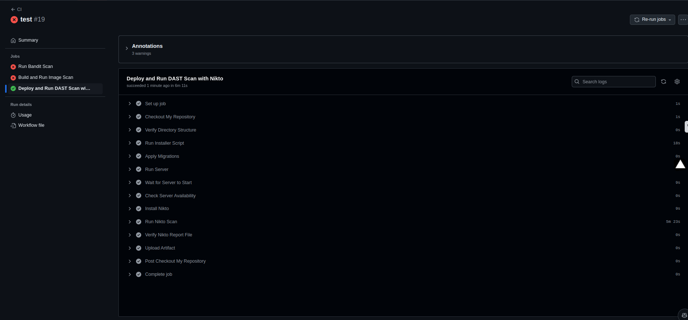
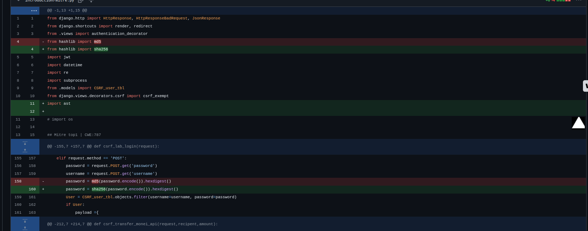

# Lab 5 - DevSecOps

### Name: Mohamad Nour Shahin, Yehia Sobeh, Ali Hamdan

### Group number: B22-CBS-01

---

In today’s rapidly evolving software development landscape, integrating security into every phase of the development lifecycle is important. DevSecOps, a combination of development, security, and operations, emphasizes the importance of embedding security practices into the DevOps workflow to ensure secure, high-quality software delivery. This lab introduces fundamental concepts and hands-on exercises to help you understand how security can seamlessly integrate into continuous integration/continuous delivery (CI/CD) pipelines. By the end of this lab, you will gain practical experience in identifying vulnerabilities, implementing security checks, and automating security tasks to build resilient systems.

**PyGoat** is the vulnerable Python application we are using in this practice.

### Instructions

- You may work in teams of up to 4 students.

- Ensure your repository is public and share its URL in the report.

- Also include links to pipeline runs that are relevant to each task you complete.

---

### Task 1: Fork the repository

Create a fork of the [https://github.com/AwwalQuan/devsecops_sample](https://github.com/AwwalQuan/devsecops_sample) GitHub repository.

### Solution:

[Link to Github repo](https://github.com/Mohammed-Nour/devsecops_sample)


### Task 2: Create the base pipeline

Create the pipeline (workflow) using GitHub actions. Work with the following pipeline configuration:

>

- It is preconfigured with the SAST scan using Bandit, and Docker image scanning using Docker Scout.

- Each job runs on the default GitHub `ubuntu-latest` runner.

- Note that the workflow authenticates to Dockerhub using secrets. You need to add your DockerHub credentials to the repository using GitHub secrets. The variables you need to configure are `DOCKERHUB_USERNAME` and `DOCKERHUB_PASSWORD`.

>

```docker
name: CI

# triggers pipeline when push is made to any branch (typical CI pipeline rule)
on: [push]

jobs:
 sast_scan:
   name: Run Bandit Scan
   runs-on: ubuntu-latest

   steps:
   - name: Checkout code
     uses: actions/checkout@v2

   - name: Set up Python
     uses: actions/setup-python@v2
     with:
       python-version: 3.8

   - name: Install Bandit
     run: pip install bandit

   - name: Run Bandit Scan
     #safe report in json format
     run: bandit -ll -ii -r . -f json -o bandit-report.json

   - name: Upload Artifact
     uses: actions/upload-artifact@v3
     #execute this step no matter of previous status
     if: always()
     with:
        #how artifacts will be named when exported
        name: bandit-findings.json
        path: bandit-report.json

 image_scan:
 #each new job runs in a new isolated environment
   name: Build and Run Image Scan
   runs-on: ubuntu-latest

   steps:
   - name: Checkout code
     uses: actions/checkout@v2

   - name: Set up Docker
     uses: docker-practice/actions-setup-docker@v1
     with:
      docker_version: '20.10.7'

   - name: Build Docker Image
     run: docker build -f Dockerfile -t mytestapp:latest .

   - name: Docker Scout Scan
     uses: docker/scout-action@v1.15.1
     with:
       dockerhub-user: ${{ secrets.DOCKERHUB_USERNAME }}
       dockerhub-password: ${{ secrets.DOCKERHUB_PASSWORD }}
       command: quickview,cves
       only-severities: critical,high
       sarif-file: scout-report.sarif
       #exit code by default is true which means 0, add true to produce non success exit code when vulns are found
       exit-code: true

   - name: Upload Artifact
     uses: actions/upload-artifact@v3
     if: always()
     with:
       name: docker-scout-findings
       path: scout-report.sarif
```

- Show that the workflow executed after you pushed the changes.

- The "Failed" ❌ status of the workflow is expected. In this case, it indicates that some vulnerabilities were discovered in the application.


### Solution:

- Adding the secrets:

  

- After create an action and its running:

  

---

### Task 3: DAST

Create a new job named dast_scan, and perform the following actions under it.

- Deploy PyGoat.

>

- You can deploy it on an `ubuntu-latest` runner.

- You might encounter some challenges when building and deploying the application. You can instead deploy the application by pulling and running from the official PyGoat repository with the following commands in your pipeline.

`docker pull pygoat/pygoat:latest`

`docker run --rm -d -p 8000:8000 pygoat/pygoat:latest`

**Bonus points** if you can build and deploy PyGoat from your own repository.

>

- Configure your workflow to perform dynamic application security test under the dast_scan job.

>

For example, you may consider any of the following tools in your pipeline: ZAP, Nikto, Arachni, etc.

>

- Show and summarize the report generated by your DAST tool.

### Solution:

I added the followinf code to `main.ymal`:

```ymal
name: CI

# triggers pipeline when push is made to any branch (typical CI pipeline rule)
on: [push]

jobs:
  sast_scan:
    name: Run Bandit Scan
    runs-on: ubuntu-latest

    steps:
      - name: Checkout code
        uses: actions/checkout@v2

      - name: Set up Python
        uses: actions/setup-python@v2
        with:
          python-version: 3.8

      - name: Install Bandit
        run: pip install bandit

      - name: Run Bandit Scan
        #safe report in json format
        run: bandit -ll -ii -r . -f json -o bandit-report.json

      - name: Upload Artifact
        uses: actions/upload-artifact@v3
        #execute this step no matter of previous status
        if: always()
        with:
          #how artifacts will be named when exported
          name: bandit-findings.json
          path: bandit-report.json

  image_scan:
    #each new job runs in a new isolated environment
    name: Build and Run Image Scan
    runs-on: ubuntu-latest

    steps:
      - name: Checkout code
        uses: actions/checkout@v2

      - name: Set up Docker
        uses: docker-practice/actions-setup-docker@v1
        with:
          docker_version: "20.10.7"

      - name: Build Docker Image
        run: docker build -f Dockerfile -t mytestapp:latest .

      - name: Docker Scout Scan
        uses: docker/scout-action@v1.15.1
        with:
          dockerhub-user: ${{ secrets.DOCKERHUB_USERNAME }}
          dockerhub-password: ${{ secrets.DOCKERHUB_PASSWORD }}
          command: quickview,cves
          only-severities: critical,high
          sarif-file: scout-report.sarif
          #exit code by default is true which means 0, add true to produce non success exit code when vulns are found
          exit-code: true

      - name: Upload Artifact
        uses: actions/upload-artifact@v3
        if: always()
        with:
          name: docker-scout-findings
          path: scout-report.sarif

  dast_scan:
    name: Deploy and Run DAST Scan with Nikto
    runs-on: ubuntu-latest

    steps:
      - name: Checkout My Repository
        uses: actions/checkout@v2

      - name: Verify Directory Structure
        run: ls -la

      - name: Run Installer Script
        run: bash installer.sh

      - name: Apply Migrations
        run: python3 manage.py migrate

      - name: Run Server
        run: nohup python3 manage.py runserver 0.0.0.0:8000 &

      - name: Wait for Server to Start
        run: sleep 10

      - name: Check Server Availability
        run: curl -I http://127.0.0.1:8000

      - name: Install Nikto
        run: sudo apt-get update && sudo apt-get install -y nikto


      - name: Run Nikto Scan
        run: |
          nikto -h http://127.0.0.1:8000 -o nikto-report.html -Format html

      - name: Verify Nikto Report File
        run: ls -la

      - name: Upload Artifact
        uses: actions/upload-artifact@v3
        with:
          name: nikto-report
          path: nikto-report.html


```

- The code is fully explained.

- The results of running the pipeline:

  

  

  

- The report of the DAST:

  you can find it here [action](https://github.com/Mohammed-Nour/devsecops_sample/actions/runs/11940693618) under Artifacts/nikto-report

  

  

  

  

- [Link to last action](https://github.com/Mohammed-Nour/devsecops_sample/actions/runs/11940693618).

---

### Task 4: Analyze vulnerabilities

- Analyze at least one critical or medium vulnerability and describe it based on the CWE or CVE databases.

>

What is the vulnerability score, the impact, the required privilege, etc.

>

---

### Solution:

**Vulnerability: PHP Image View Cross-Site Scripting (XSS)**

- **URI**: /phpimageview.php?pic=javascript:alert(8754)

- **Description**: PHP Image View 1.0 is vulnerable to Cross-Site Scripting (XSS). This allows an attacker to inject arbitrary JavaScript code into the application.

- **Impact**:

  - An attacker could execute malicious scripts in the context of a user's browser.

  - This can lead to:

    - Theft of session cookies.

    - Execution of unauthorized actions on behalf of the victim (CSRF).

    - Phishing or malware delivery.

**Analysis of the Vulnerability**:

1.  CVSS Score

    Using the Common Vulnerability Scoring System (CVSS), this vulnerability typically has:

    - **Base Score**: 9.9 (Critical)

      

2.  CWE Reference:

    - **CWE-79**: Improper Neutralization of Input During Web Page Generation ('Cross-Site Scripting').

    - The application fails to validate or sanitize user input before rendering it in the browser, allowing attackers to inject scripts.

**Remediation Steps**:

1. Input Validation:


    - Sanitize all user inputs to ensure only valid data is accepted.

    - Use a server-side library like ```htmlspecialchars`` in PHP to escape potentially dangerous characters.

2. Output Encoding:


    - Encode any data before rendering it in the browser to prevent injection.

3. Content Security Policy (CSP):


    - Add a CSP header to restrict the execution of scripts:

    ```bash
    Content-Security-Policy: default-src 'self';
    ```

**Required Privileges**:

- None: The vulnerability is exploitable without authentication, making it critical in multi-user environments.

---

### Bonus task: Patch vulnerability

- Patch some vulnerabilities in the application code or the Docker image and show the results from your SAST and DAST scan to validate your fix.

### Solution:

before patching:


after patching:

You can check the bandit-report file in the [artificat section](https://github.com/Mohammed-Nour/devsecops_sample/actions/runs/11949953421):



---
